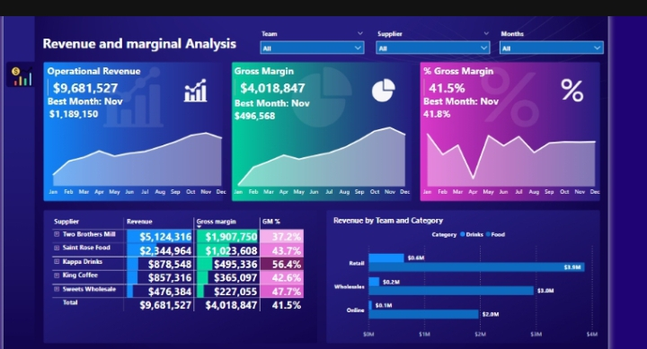

## REVENUE AND MARGIN PERFORMANCE DASHBOARD FOR SUPPLIER AND TEAM ANALYSIS 

## TABLE OF CONTENTS 
 [Overview]()

 [Description]() 

 [Problem Statement]() 
 
 [Objective]() 
  
 [Key areas analysed]() 
 
 [Tools]()
 
 [Dashboard]()
 
 [Insights]() 
 
 [Recommendation]() 

## OVERVIEW 
This Power BI dashboard provides a strategic overview of operational revenue, gross margin, and profitability trends across suppliers and sales teams. Designed to support performance reviews and sales optimization efforts, it enables quick identification of inefficiencies, profit gaps, and growth opportunities across sales channels and product categories

## DESCRIPTION
High revenue does not always equal high profitability. This dashboard helps stakeholders move beyond top-line figures by delivering a layered analysis of gross margin and margin percentages across multiple dimensions—supplier, team, category, and channel.

Key performance metrics are visualized with clarity, helping sales managers, financial analysts, and procurement teams:

1️⃣ Evaluate which suppliers are driving or draining profit

2️⃣ Understand seasonal patterns in sales and margin

3️⃣ Identify the most and least effective sales teams and categories

4️⃣ Guide strategic decisions based on actionable insights

## PROBLEM STATEMENT 
There is insufficient visibility into how revenue and gross margin vary by supplier and sales team, resulting in missed opportunities to optimize sales strategies and enhance overall profitability.

## OBJECTIVE 
To monitor and analyze the revenue performance, gross margin, and gross margin percentage across different suppliers and sales teams, enabling data-driven decisions that enhance profitability and sales efficiency.

## KEY AREAS ANALYZED
1️⃣ **Operational Revenue** – Total revenue performance with monthly trends

2️⃣ **Gross Margin** – Monthly and cumulative gross profit to assess cost efficiency

3️⃣ **Gross Margin %** – Profitability ratio trend over the year

4️⃣ **Supplier Performance** – Comparison of revenue and margin contributions by suppliers

5️⃣ **Team & Category Revenue** – Revenue contribution by sales team across Retail, Wholesale, and Online channels, broken down by product categories (Food, Drinks, Sweets)

## TOOLS USED:

Excel: For data cleaning.

Power BI: For Data modelling, visualization and dashboard creation.

## DASHBOARD PREVIEW 

## INSIGHTS GAINED
### 1️⃣ Overall Performance

**-Total Operational Revenue:** $9.68M

**-Gross Margin:** $4.01M

**-Gross Margin %:** 41.5%

### 2️⃣ Top Performing Month

**-November recorded the best performance:**

**-Revenue:** $1.18M

**-Gross Margin:** $496.5K

### 3️⃣ Top Supplier

**-Two Brothers Mill leads in revenue ($5.12M) but has a low gross margin % (37.2%), suggesting potential cost inefficiencies.**

**-Kappas Drinks maintains the highest margin % (56.4%) despite lower revenue, indicating stronger pricing or cost control.**

### 4️⃣ Sales Channel Contribution

**-Retail dominates across all categories:**

**-Drinks:** $3.9M

**-Food:** $0.6M

**-Online sales** lag significantly and represent a major opportunity for growth.

## RECOMMENDATION 
1️⃣ **Improve Margin Management for Top Suppliers:** Engage with Two Brothers Mill to explore cost optimization or pricing strategies to improve profitability.

2️⃣ **Scale High-Margin Suppliers:** Increase focus on suppliers like Kappas Drinks for their better return on sales.

3️⃣ **Channel Strategy Optimization:** Strengthen the Online channel, especially for high-performing categories like Drinks.

4️⃣ **Focus on High-Performing Months:** Replicate successful strategies from November to maintain performance consistency.

5️⃣ **Team-Level Strategy:** Analyze and share best practices from high-performing Retail teams across other segments.

## Contact
Created by **Ajirola Amudat**  
For inquiries, connect on [LinkedIn](https://www.linkedin.com/in/ajirola-amudat-a-3083882b2?utm_source=share&utm_campaign=share_via&utm_content=profile&utm_medium=android_app)

